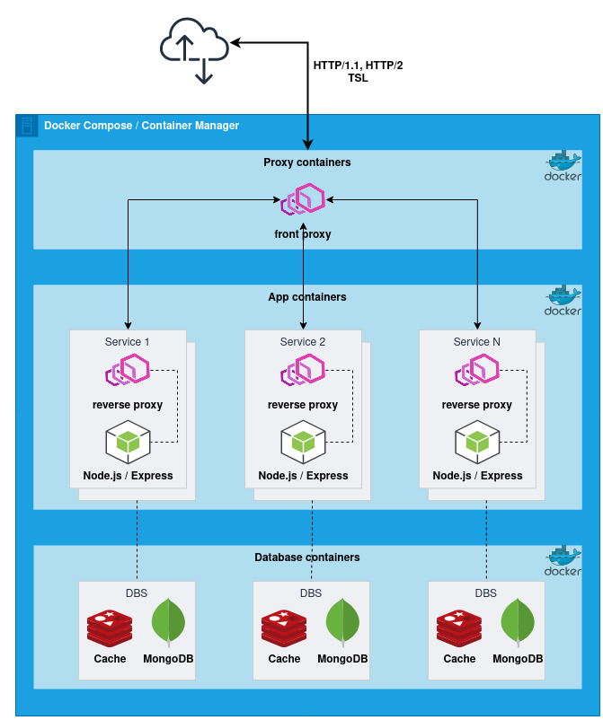

# High Performance API
## Requirements
- Envoy Proxy
- Node.js / Express
- Docker / Docker Compose
- Taurus (gatling)
- jq
## Architecture Diagram


## Run and test
```shell
docker-compose up --build -d
# Check service
./scripts/rep.sh 
```
Scale service
```commandline
docker-compose scale service1=4
```

## REST API
After starting docker-compose the service should be exposed on `http://localhost:8080`. These are the available endpoints:

```http request
GET http://localhost:8080/api/traceIP/:ip
Accept: application/json

GET http://localhost:8080/api/stats
Accept: application/json
```

## Stress Test
Para este proyecto vamos usar Tautus para realizar pruebas de rendimiento se establece dos escenarios de pruebas:

[Resultados de pruebas de estrés](./stress-test.html).
